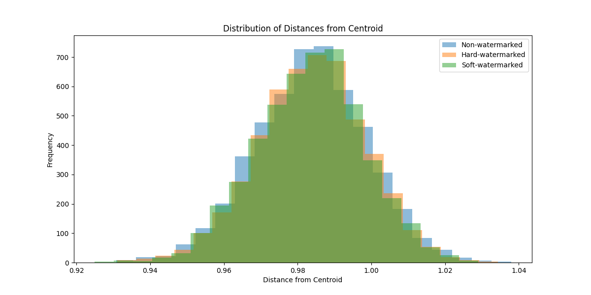
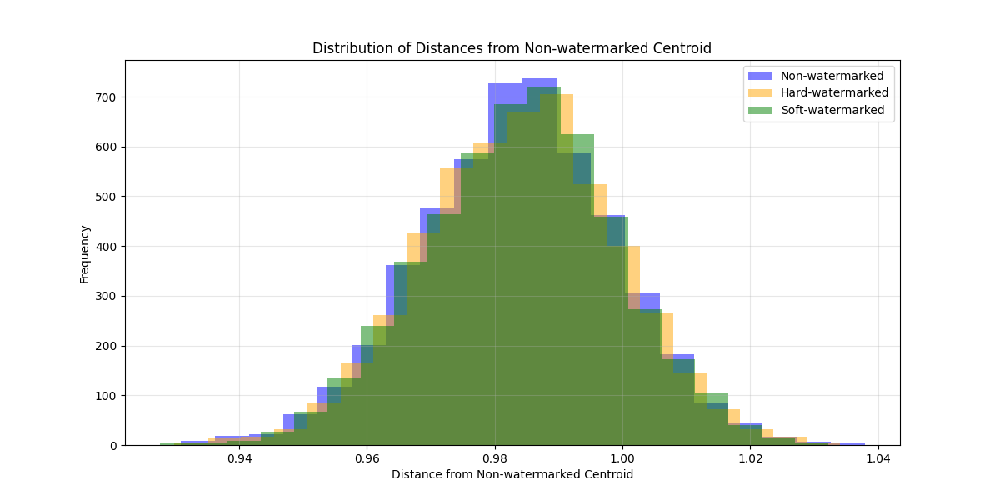

# 🔍 Assessing Text Integrity: Evaluating the Effect of Watermarking in LLMs

A research project investigating whether LLM watermarking techniques degrade the semantic quality of generated text, using centroid-based embedding analysis across 15,000 generated samples.

Conducted as **APPS597 Supervised Independent Study** during the Master of Applied Science in Artificial Intelligence at the University of Otago, New Zealand.

**Supervisor:** Andrew Trotman, Associate Professor, University of Otago

---

## 📌 What This Project Does

The rapid adoption of large language models has raised concerns about misuse — AI-driven misinformation, academic dishonesty, and copyright violation. Watermarking offers a solution by embedding detectable signals into LLM outputs. But does watermarking change the meaning of the generated text?

This project applies two watermarking schemes based on Kirchenbauer et al.'s work to the LLaMA 3.1 8B model, then measures their impact on text quality using semantic similarity and centroid distance analysis across the MS MARCO dataset.

**Research questions:**
1. Do watermarking techniques degrade the semantic quality of LLM outputs?
2. How do hard and soft watermarking compare in practice?

---

## 🔬 Watermarking Techniques

Both techniques partition the vocabulary into "green" and "red" token lists using a cryptographic hash function and a secret key. Green list ratio (γ) is set to 0.5.

**Hard Watermarking** — completely suppresses red-list tokens by setting their logits to negative infinity, guaranteeing certain tokens never appear in the output.

**Soft Watermarking** — raises the logits of green-list tokens by a delta value (δ = 2.0), biasing token selection without blocking any options entirely.

---

## 🧪 Experiment Design

- **Dataset:** MS MARCO — 1,000 random passages sampled from 8 million
- **Model:** LLaMA 3.1 8B via Ollama API (max 50 tokens per response)
- **Samples:** 5 responses per prompt × 3 conditions × 1,000 prompts = **15,000 total samples**
- **Embeddings:** `all-MiniLM-L6-v2` (SentenceTransformers)
- **GPU:** CUDA acceleration via PyTorch
- **Distance metric:** Euclidean distance from centroid

Three phases were run on the same 1,000 prompts: non-watermarked (baseline), hard-watermarked, and soft-watermarked. For each prompt, the centroid of its 5 embeddings was calculated, and each sample's Euclidean distance from that centroid was measured.

---

## 📊 Results

### Distance from centroid

| Metric | Non-watermarked | Hard-watermarked | Soft-watermarked |
|---|---|---|---|
| Mean distance | 0.9835 | 0.9837 | 0.9835 |
| Standard deviation | 0.0151 | 0.0146 | **0.0145** |
| Maximum distance | 1.0379 | 1.0344 | **1.0290** |
| Minimum distance | 0.9309 | 0.9311 | 0.9250 |
| Results above mean | 1,519 | 1,566 | 1,567 |
| Results below mean | 1,526 | 1,506 | 1,513 |
| Results near mean | 1,955 | 1,928 | 1,920 |

Mean distances are essentially identical across all three conditions (0.9835–0.9837), showing watermarking does not shift the overall semantic distribution of outputs. Soft watermarking shows the smallest standard deviation and maximum distance, indicating the most consistent output quality.

### Figure 1 — Distribution of distances from each system's own centroid



All three systems maintain near-identical bell-shaped distributions peaking at 0.98–0.99, confirming that watermarking preserves the statistical properties of the original text generation process.

### Figure 2 — Distribution of distances from the non-watermarked centroid



When measuring all three systems against the same non-watermarked centroid, the distributions still overlap substantially — confirming that watermarked outputs cluster in the same region of embedding space as non-watermarked outputs.

### Inter-system centroid distances

| Comparison | Centroid distance |
|---|---|
| Non-watermarked → Hard-watermarked | 0.0313 |
| Non-watermarked → Soft-watermarked | 0.0304 |
| Hard-watermarked → Soft-watermarked | **0.0085** |

Watermarked systems are statistically distinguishable from non-watermarked output (0.0304–0.0313), but the two watermarking approaches produce nearly identical distributions (0.0085 apart) — confirming both methods achieve similar efficacy, with soft watermarking marginally closer to the original.

### Key findings

- Both techniques maintain text quality with minimal semantic degradation
- Soft watermarking performs marginally better — smaller standard deviation (0.0145 vs 0.0151) and lower maximum distance (1.029 vs 1.0379)
- Watermarks are statistically detectable yet do not meaningfully alter text meaning
- Computational constraint: 72 hours on available GPU to process 15,000 samples

---

## 🛠️ Tech Stack

| Component | Tool |
|---|---|
| LLM | [Ollama](https://ollama.com) + LLaMA 3.1 8B |
| Embeddings | SentenceTransformers (`all-MiniLM-L6-v2`) |
| Data processing | pandas, numpy |
| Distance metrics | scipy |
| Visualisation | matplotlib |
| GPU acceleration | PyTorch + CUDA |
| Dataset | MS MARCO |

---

## ✅ Prerequisites

- Python 3.10+
- [Ollama](https://ollama.com) installed and running
- Conda (recommended for environment management)
- MS MARCO `collection.tsv` file

---

## 🚀 Setup and Usage

**1. Create and activate a conda environment**

```bash
conda create --name watermarking
conda activate watermarking
```

**2. Install dependencies**

```bash
pip install requests numpy transformers sentence-transformers pandas scipy matplotlib torch
```

**3. Install Ollama and pull the model**

```bash
# Install from https://ollama.com then pull the model
ollama pull llama3.1:8b
ollama serve          # leave running in a separate terminal
```

**4. Run the main experiment**

Generates 15,000 text samples (1,000 prompts × 5 samples × 3 conditions) and saves them to CSV:

```bash
python watermarking.py
```

**5. Analyse results**

Computes distance statistics and plots distribution of distances from each system's own centroid:

```bash
python analysis.py
```

Plots distribution of distances from the non-watermarked centroid for all three systems:

```bash
python compute.py
```

**6. Deactivate the environment when done**

```bash
conda deactivate
```

---

## 📁 Project Structure

```
Watermarking-on-LLMs/
├── watermarking.py                    # Main experiment — generates all 15,000 samples
├── analysis.py                        # Computes centroid stats + inter-system distances
├── compute.py                         # Plots distances from non-watermarked centroid
├── collection.tsv                     # MS MARCO dataset (not included, download separately)
├── results/
│   ├── non_watermarked_results.csv        # Baseline outputs + embeddings
│   ├── hard_watermarked_results.csv       # Hard watermarked outputs + embeddings
│   ├── soft_watermarked_results.csv       # Soft watermarked outputs + embeddings
│   ├── hard_watermarked_with_centroid.csv # Manually derived from hard results for report analysis
│   └── soft_watermarked_with_centroid.csv # Manually derived from soft results for report analysis
├── Figure_1.png                       # Distribution of distances from each system's centroid
├── Analysis.png                       # Distribution of distances from non-watermarked centroid
└── README.md
```

**Primary result CSVs** (generated by `watermarking.py`):

| Column | Description |
|---|---|
| `id` | Prompt identifier from MS MARCO |
| `prompt` | The original input passage |
| `generated_text` | LLM response (with token ID appended for watermarked outputs) |
| `distance_from_centroid` | Euclidean distance from the prompt's 5-sample centroid |
| `semantic_similarity` | Cosine similarity between prompt and response embeddings |
| `embedding` | Full 384-dimensional embedding vector (JSON) |

**Centroid CSVs** (manually derived from the primary results for report analysis):

| Column | Description |
|---|---|
| `id` | Prompt identifier |
| `prompt` | The original input passage |
| `watermarked_text` | The watermarked generated text |
| `semantic_similarity` | Cosine similarity between prompt and response |
| `centroid` | Mean embedding vector across all responses for that prompt |
| `distance_from_centroid` | Euclidean distance from the computed centroid |

---

## ⚠️ Known Limitations

- Experiment limited to 1,000 prompts per condition due to GPU constraints (72 hours runtime)
- LLaMA 3.1 8B only — larger models (70B, 405B) not tested
- Robustness against attacks (paraphrasing, text manipulation) not evaluated
- Watermarking logic applied post-generation via logit modification rather than integrated into the model's decoding loop

---

## 🔭 Future Work

- Distributed GPU clusters for larger dataset processing
- Robustness testing against paraphrasing and mixing attacks
- Model scaling experiments with LLaMA 3.1 70B and 405B
- Integration of watermarking directly into the decoding loop
- Standardised benchmarking framework for watermark quality metrics

---

## 📄 Based On

> J. Kirchenbauer, J. Geiping, Y. Wen, J. Katz, I. Miers, and T. Goldstein, "A Watermark for Large Language Models," arXiv:2301.10226, 2023.

---

## 👤 Author

**Sooraj Srinivasa Babu**

Master of Applied Science in Artificial Intelligence, University of Otago, New Zealand

[LinkedIn](https://linkedin.com/in/soorajsrinivasababu)
